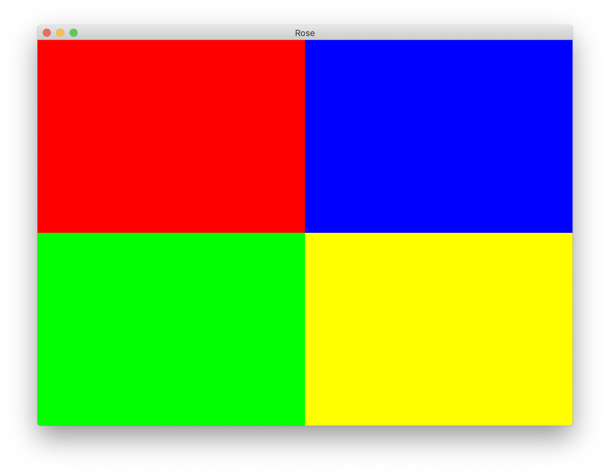

# 🌹 Rose
A Kotlin library for making user interfaces

# Experiments

````kotlin
fun app(): Render = flexRow(
    flexColumn(
        box(Color.RED),
        box(Color.GREEN)
    ),
    flexColumn(
        box(Color.BLUE),
        box(Color.YELLOW)
    )
)

fun main() {
    Container(app()).run()
}
````

The above code produces the following result:


